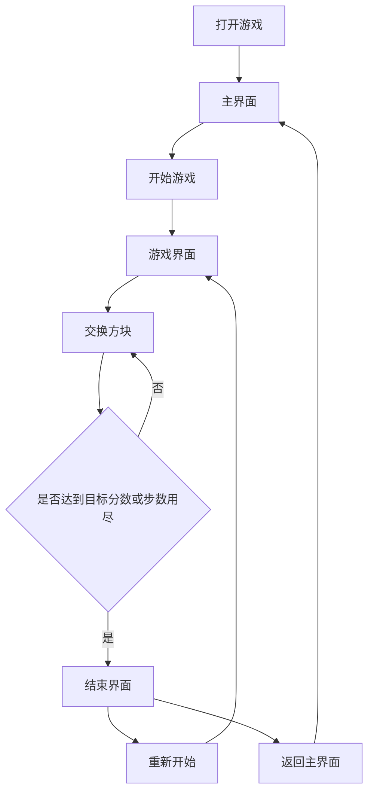

## 1. Product Overview
开心消消乐是一款休闲益智类消除游戏，玩家通过匹配相同图案的方块来获得分数。
- 主要面向休闲游戏爱好者，提供简单易上手但富有挑战性的游戏体验
- 目标是提供一款轻松愉快的游戏，帮助用户放松心情，打发碎片时间

## 2. Core Features

### 2.1 User Roles
| 角色 | 注册方式 | 核心权限 |
|------|---------------------|------------------|
| 普通玩家 | 无需注册 | 玩游戏、查看分数排行榜 |

### 2.2 Feature Module
1. **游戏主界面**：游戏标题、开始游戏按钮、排行榜入口、设置按钮
2. **游戏界面**：游戏棋盘、分数显示、剩余步数/时间、暂停按钮
3. **结束界面**：最终得分、重新开始按钮、返回主界面按钮

### 2.3 Page Details
| 页面名称 | 模块名称 | 功能描述 |
|-----------|-------------|---------------------|
| 游戏主界面 | 游戏标题 | 显示游戏名称和logo |
| 游戏主界面 | 开始游戏按钮 | 点击进入游戏界面 |
| 游戏主界面 | 排行榜入口 | 查看历史最高分 |
| 游戏主界面 | 设置按钮 | 调整音效、难度等 |
| 游戏界面 | 游戏棋盘 | 显示方块矩阵，支持点击交换方块 |
| 游戏界面 | 分数显示 | 实时显示当前得分 |
| 游戏界面 | 剩余步数/时间 | 显示剩余操作次数或时间 |
| 游戏界面 | 暂停按钮 | 暂停游戏，显示继续/返回主界面选项 |
| 结束界面 | 最终得分 | 显示本局游戏的最终得分 |
| 结束界面 | 重新开始按钮 | 点击重新开始游戏 |
| 结束界面 | 返回主界面按钮 | 返回游戏主界面 |

## 3. Core Process
用户打开游戏 → 进入主界面 → 点击开始游戏 → 进入游戏界面 → 交换方块进行消除 → 达到目标分数或步数用尽 → 进入结束界面 → 查看得分 → 选择重新开始或返回主界面

## 4. User Interface Design
### 4.1 Design Style
- 主色调：明亮的蓝色 (#4A90E2) 和黄色 (#F5A623)
- 辅助色：绿色 (#7ED321)、红色 (#D0021B)、紫色 (#9013FE)
- 按钮风格：圆角按钮，有轻微的3D效果
- 字体：无衬线字体，主标题使用较大较粗的字体
- 布局风格：居中布局，卡片式设计
- 图标/表情风格：可爱、卡通风格，使用简单的几何形状和明亮的颜色

### 4.2 Page Design Overview
| 页面名称 | 模块名称 | UI元素 |
|-----------|-------------|-------------|
| 游戏主界面 | 游戏标题 | 大字体，彩色渐变效果，位于页面顶部 |
| 游戏主界面 | 开始游戏按钮 | 醒目的黄色按钮，位于页面中央，悬停时有放大效果 |
| 游戏主界面 | 排行榜入口 | 蓝色按钮，位于页面右侧 |
| 游戏主界面 | 设置按钮 | 小型齿轮图标，位于页面右上角 |
| 游戏界面 | 游戏棋盘 | 6x6或8x8的方块矩阵，每个方块有不同的图案，消除时有动画效果 |
| 游戏界面 | 分数显示 | 位于页面顶部，数字变化时有动画效果 |
| 游戏界面 | 剩余步数/时间 | 位于页面顶部，与分数显示并列 |
| 游戏界面 | 暂停按钮 | 小型暂停图标，位于页面右上角 |
| 结束界面 | 最终得分 | 大字体显示，位于页面中央 |
| 结束界面 | 重新开始按钮 | 绿色按钮，位于得分下方 |
| 结束界面 | 返回主界面按钮 | 蓝色按钮，位于重新开始按钮下方 |

### 4.3 Responsiveness
- 设计采用响应式布局，适配桌面端和移动端
- 桌面端：使用鼠标点击操作
- 移动端：优化触摸操作，支持手势滑动
- 在小屏幕设备上，游戏棋盘会自动调整大小以适应屏幕

### 4.4 3D Scene Guidance
- 游戏采用2D界面，不需要3D场景
- 方块消除时可添加简单的动画效果，如缩放、旋转等