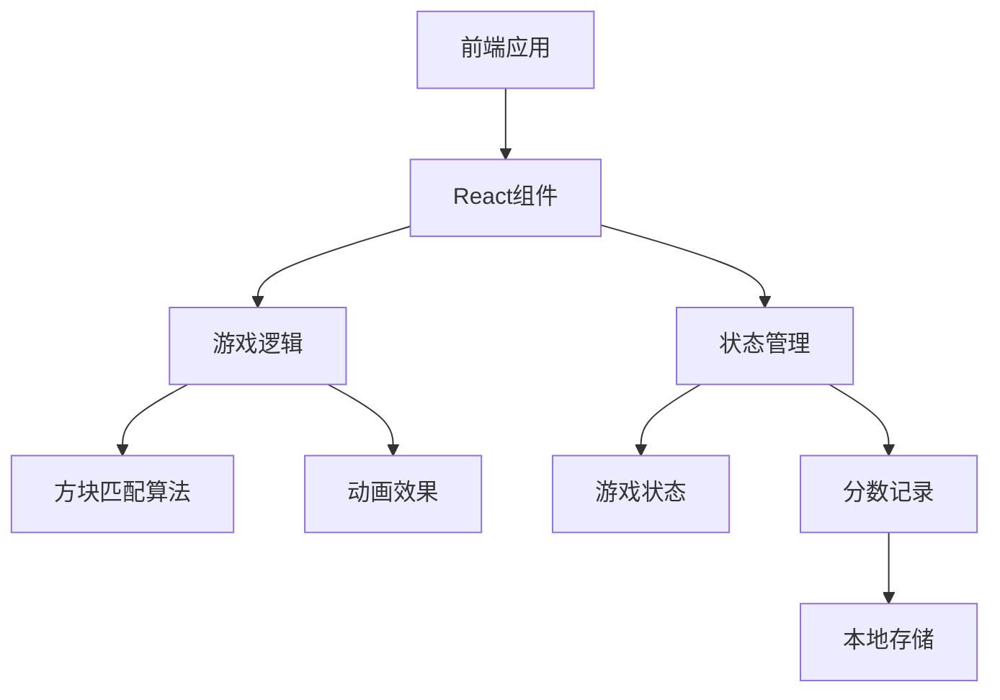

## 1. Architecture Design


## 2. Technology Description
- 前端：React@18 + tailwindcss@3 + vite
- 初始化工具：vite-init
- 后端：None（游戏逻辑在前端实现）
- 数据存储：localStorage（用于保存游戏进度和分数）

## 3. Route Definitions
| 路由 | 目的 |
|-------|---------|
| / | 游戏主界面 |
| /game | 游戏界面 |
| /end | 结束界面 |

## 4. API Definitions
- 无后端API，游戏逻辑完全在前端实现

## 5. Server Architecture Diagram
- 无后端服务器架构

## 6. Data Model
### 6.1 Data Model Definition
- 游戏状态：包含棋盘状态、分数、剩余步数/时间
- 方块：包含类型、位置、状态
- 分数记录：包含玩家得分、游戏日期

### 6.2 Data Definition Language
- 使用JavaScript对象存储游戏状态
- 使用localStorage存储分数记录

```javascript
// 游戏状态结构
const gameState = {
  board: [
    [0, 1, 2, 3, 4, 5],
    [1, 2, 3, 4, 5, 0],
    // 6x6或8x8的方块矩阵
  ],
  score: 0,
  moves: 30, // 剩余步数
  time: 60, // 剩余时间（如果是限时模式）
  gameOver: false
};

// 分数记录结构
const scoreRecord = {
  score: 1000,
  date: new Date().toISOString()
};
```